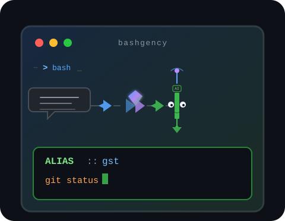

<p align="center">
  
  <br>
  
</p>

<p align="center">
  CLI that generates shell aliases, functions, modules and executes commands via AI (multi-provider).
</p>

## What it is

**Bashgency** turns natural-language descriptions into shell aliases, functions, modules, or direct command execution. It calls your configured AI provider, shows a preview, and performs the action after your confirmation.

**Tier 1 providers:** DeepSeek, OpenAI, Anthropic (Claude), Google Gemini. More connectors: see [`docs/adding-a-provider.md`](docs/adding-a-provider.md).

```
User describes need
        |
        v
   bashgency (CLI)
        |
        v
  AI provider API  -->  shell code or command
        |
        v
  preview + confirmation
        |
        v
  aliases file / command execution / module file
```

## Prerequisites

| Tool | Required | Install (Debian/Ubuntu) |
| ---- | -------- | ----------------------- |
| `curl` | Yes | `sudo apt install curl` |
| `jq` | Yes | `sudo apt install jq` |
| `python3` | Recommended | JSON parse fallback |
| zsh or bash | Yes | included in WSL/Linux |

## Installation

### 1. Clone the repository

```bash
git clone git@github.com:nevesbruno/bashgency.git ~/lab/bashgency
```

### 2. Configure runtime

```bash
bash ~/lab/bashgency/install.sh
# Pick provider in the installer, or edit ~/.config/bashgency/env:
#   BASHGENCY_PROVIDER="deepseek"   # or openai | anthropic | gemini
#   DEEPSEEK_API_KEY="sk-..."       # matching key for the provider
```

The installer prompts for **provider + API key** and can add `source` lines to your shell config (`.zshrc`, `.bashrc`, etc.) automatically.

### 3. Load in your shell

If you skipped the installer prompt, add this to `~/.zshrc` or your `alias.sh` (e.g. [bash-stuffs](https://github.com/nevesbruno/bash-stuffs)):

```bash
[ -f "$HOME/lab/bashgency/modules/bashgency-cli.sh" ] && \
  source "$HOME/lab/bashgency/modules/bashgency-cli.sh"
```

Generated aliases go to `~/.config/bashgency/aliases.sh` by default. Load them in your shell:

```bash
[ -f "$HOME/.config/bashgency/aliases.sh" ] && \
  source "$HOME/.config/bashgency/aliases.sh"
```

**Override:** to write to another file (e.g. dotfiles), in `~/.config/bashgency/env`:

```bash
BASHGENCY_TARGET="$HOME/lab/bash-stuffs/alias.sh"
```

**Security:** never commit your API key. The `env` file stays outside git.

## Usage modes

### Interactive (default)

```bash
bashgency
```

### Alias/function mode

```bash
bashgency -p "alias to show a colorful diff with stat"
```

### Run mode (semantic command execution)

Describe a task in natural language; bashgency generates the shell command, shows a preview, and executes it on approval.

```bash
bashgency -r "list all text files containing lorem ipsum"
```

Auto-confirm without prompt:

```bash
bashgency -r "find the 5 largest files" -y
```

Example output:

```
$ bashgency -r "list all listening ports with process"
generating command via deepseek/deepseek-chat...

+-- query ---+
  request : list all listening ports with process
  model   : deepseek-chat
  status  : response received (2s)
+------------+

+-- command -----------------------------+
  $ ss -tlnp | tail -n +2
+------------------------------------------+

>>> Execute? [Y/n] y

State    Recv-Q   Send-Q     Local Address:Port     Peer Address:Port  Process
LISTEN   0        128              0.0.0.0:22            0.0.0.0:*      ...
...
```

### Preview (no apply)

```bash
bashgency -p "function to create a branch with date in the name" --preview
bashgency -p "description" -v
```

### Force (skip confirmation)

```bash
bashgency -p "alias gst for git status" --force
bashgency -r "find large files" -y
```

### Help

```bash
bashgency -h
```

## Flow after code generation (alias mode)

1. **Query** -- request, model, and response time
2. **Preview** -- formatted alias/function/module
3. **Menu** -- `1` apply | `2` retry | `3` exit

## Run mode flow

1. **Query** -- request, model, response time
2. **Command preview** -- proposed shell command
3. **Approval** -- `[Y/n]` prompt (or `-y` to skip)
4. **Execution** -- command runs directly on your terminal
5. **Audit** -- entry saved to `~/.config/bashgency/history` as type `COMMAND`

## Where code/commands are saved

| Generated type | Default destination |
| -------------- | ------------------- |
| Alias / inline function | `~/.config/bashgency/aliases.sh` |
| Complex module | `~/.config/bashgency/modules/<name>.sh` + `source` in aliases file |
| Command execution | `~/.config/bashgency/history` (type `COMMAND`) |

With `BASHGENCY_TARGET` set, aliases and functions go to that file.

## Directory layout

| Path | Role |
| ---- | ---- |
| `~/lab/bashgency/modules/bashgency-cli.sh` | Versioned source |
| `~/lab/bashgency/modules/lib/run.sh` | Command execution module |
| `~/.config/bashgency/env` | Provider + API keys |
| `~/.config/bashgency/aliases.sh` | Generated aliases (default) |
| `~/.config/bashgency/history` | Creation log (alias/function/module + COMMAND) |
| `~/.config/bashgency/backups/` | Automatic backups |
| `~/.config/bashgency/modules/*.sh` | AI-generated modules |

## Troubleshooting

### Module not found

Clone to `~/lab/bashgency` and add the `source` line to your shell.

### Missing API key

```bash
bash ~/lab/bashgency/install.sh
# Set BASHGENCY_PROVIDER and the matching *_API_KEY in ~/.config/bashgency/env
```

### HTTP 401/403 error

```bash
bashgency --configure
# or re-run when prompted after an auth error (one automatic retry)
bash ~/lab/bashgency/scripts/test_api.sh
bash ~/lab/bashgency/scripts/test_api.sh openai
```

Set `BASHGENCY_NONINTERACTIVE=1` to disable reconfigure prompts in scripts.

### Switch provider per command

```bash
bashgency -P anthropic -p "alias gst for git status" --preview
```

### Alias not available after apply

```bash
source ~/.zshrc
source ~/.config/bashgency/aliases.sh
```

### Uninstall

```bash
./uninstall.sh
# Menu: 1 = with repo (delete clone), 2 = without repo (default)
```

Non-interactive: `--keep-repo -y` or `--remove-repo -y`. Do not `source uninstall.sh`.

### Revert

```bash
ls ~/.config/bashgency/backups/
cp ~/.config/bashgency/backups/alias_backup_YYYYMMDD_HHMMSS.sh \
   ~/.config/bashgency/aliases.sh
source ~/.config/bashgency/aliases.sh
```

## Contributing

MIT. Issues and PRs welcome. Architecture: [docs/developer-guide.md](./docs/developer-guide.md). Flags: [docs/cli-reference.md](./docs/cli-reference.md).

## Note for AI agents

Read [docs/developer-guide.md](./docs/developer-guide.md) before changing code. Minimal diffs, `__bashgency_*` conventions, and `TYPE ::` format. Never commit secrets.

## Version

See `VERSION`. Current: **1.8.0**.
